# Lab4Web

## Belajar Membuat Box Element dan Layout Sederhana

### Membuat Box Element
Pertama, buatlah dokumen html dengan nama file lab4_box.html dan tambahkan kode untuk membuat box element dengan tag div begini tampilannya :
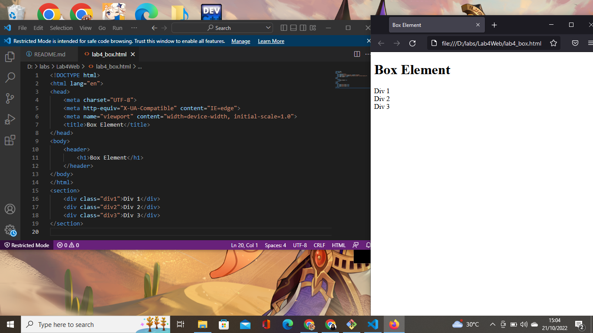

Kedua, tambahkan deklarasi css dengan tampilan seperti ini:
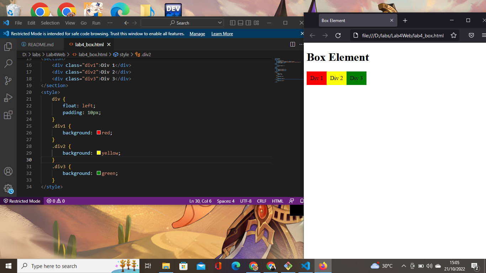

Terakhir, menggunakan clearfix untuk mengatur element setelah float element dengan tampilan seperti ini:
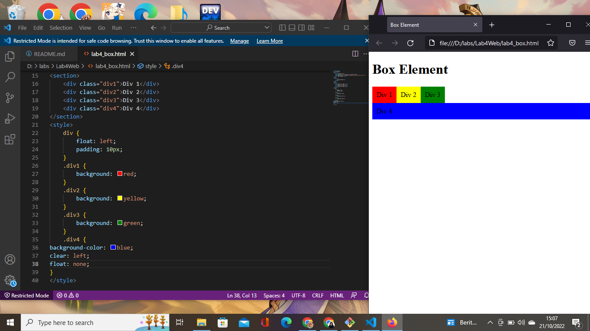

### Membuat Layout Sederhana
Buatlah folder baru dengan nama lab4_layout.html yang di dalamnya terdapat 2 file dengan nama home.html dan style.css. Lalu tambahkan kode untuk kerangka layout nya dan tambah kode css untuk membuat layoutnya beginilah tampilannya:
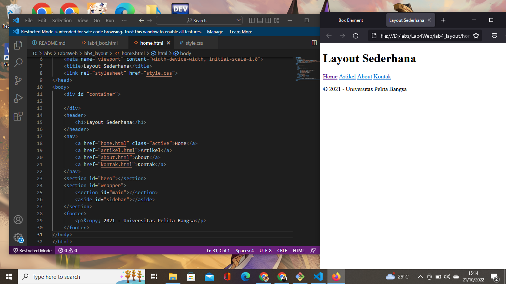
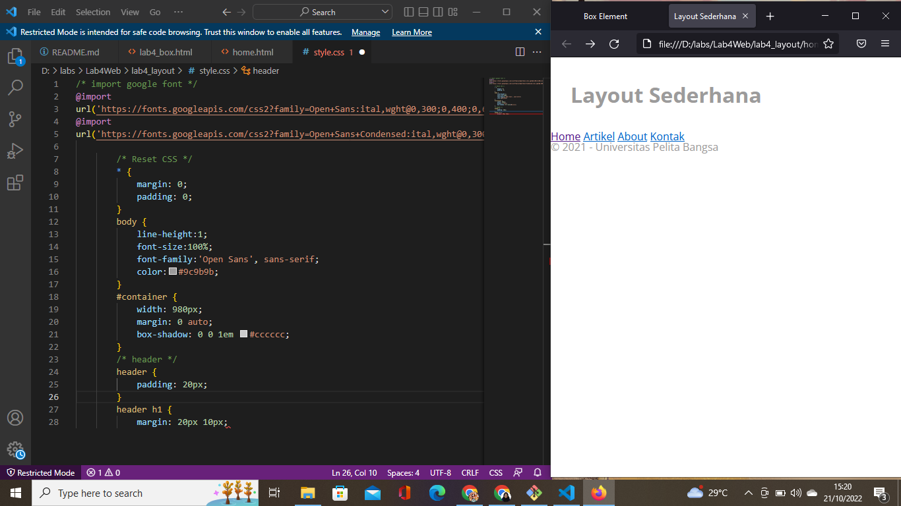

### Membuat Navigasi
Membuat navigasi dengan tampilan berikut:
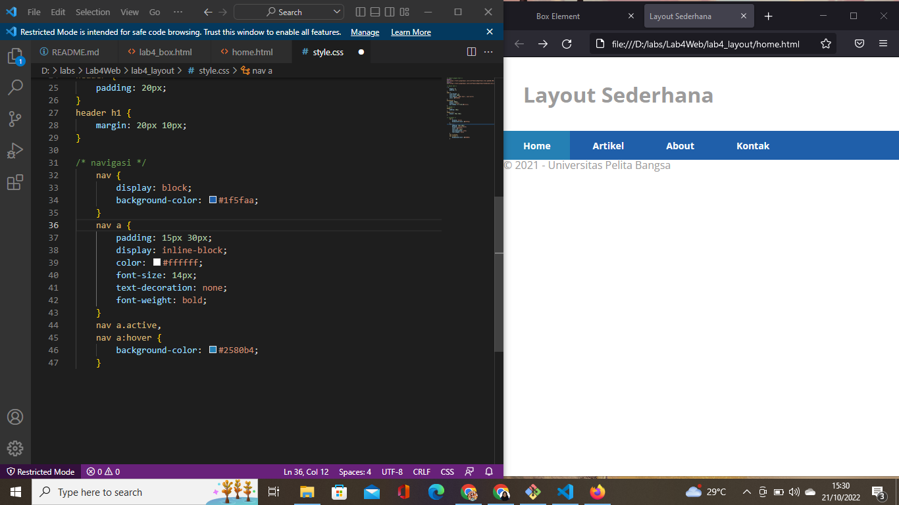

### Membuat Hero Panel
Membuat hero panel dengan menambahkan kode pada file html dan file css, beginilah tampilannya:
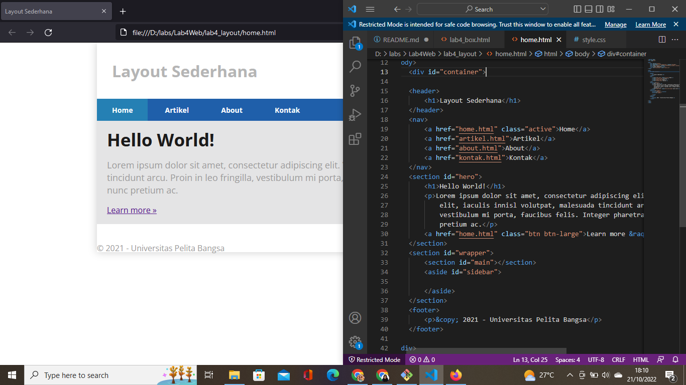
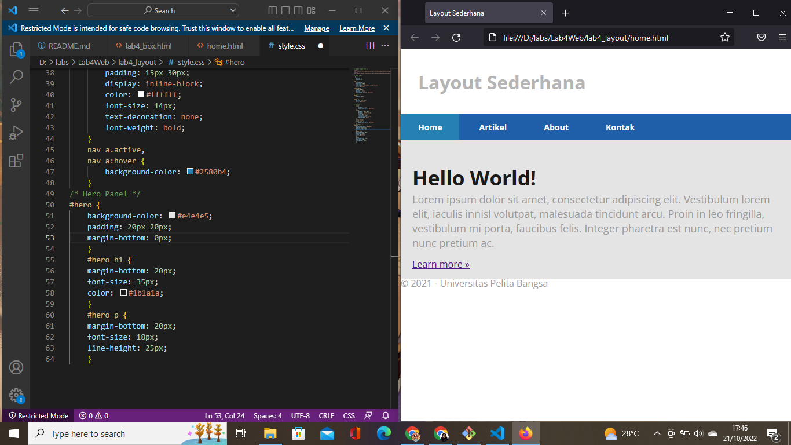

### Mengatur Layout Main dan Sidebar
Menambahkan kode atau element lain kedalam sidebar dengan tampilan berikut:
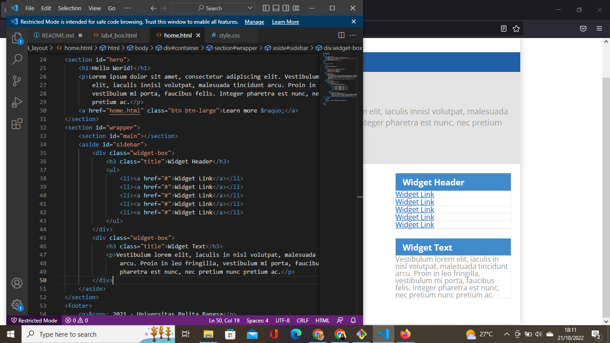

Lalu, tambahkan kode css nya ke file style_css dengan tampilan berikut:
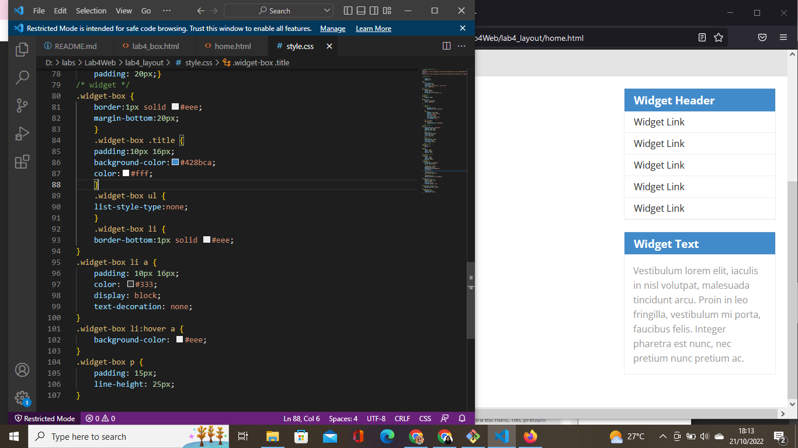

### Mengatur Footer
Mengatur atau menambahkan footer dengan menggunakan css, begini penampilannya:
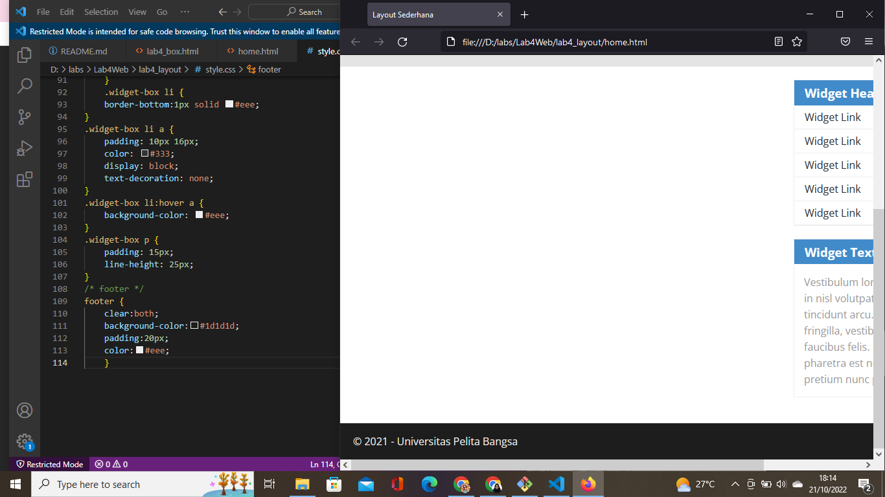

### Menambahkan Elemen lain pada Main Content
Menambahkan kode di dalam syntax section main/main content, begini penampilannya:
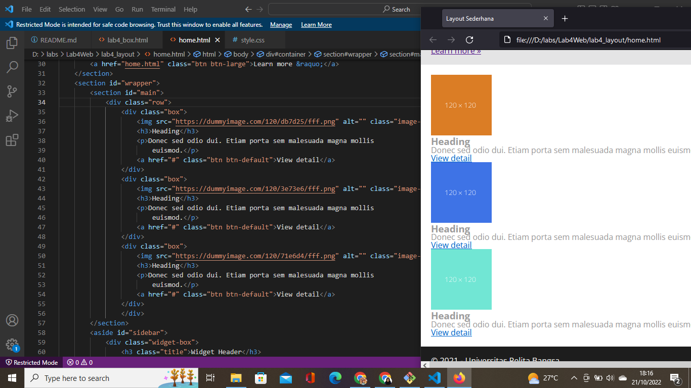

lalu, menggunakan css seperti berikut:
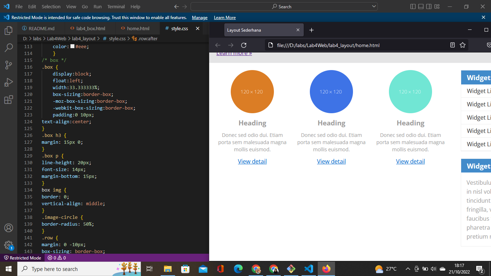
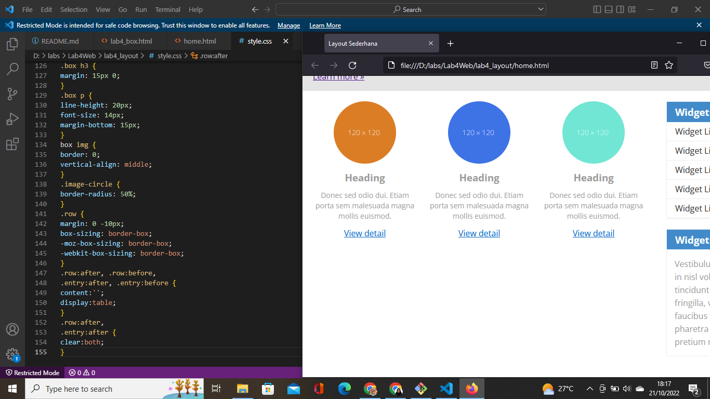

### Menambahkan Content Artikel
Menambahkan content artikel ke dalam file html dan masuk ke dalam main content, berikut tampilannya:
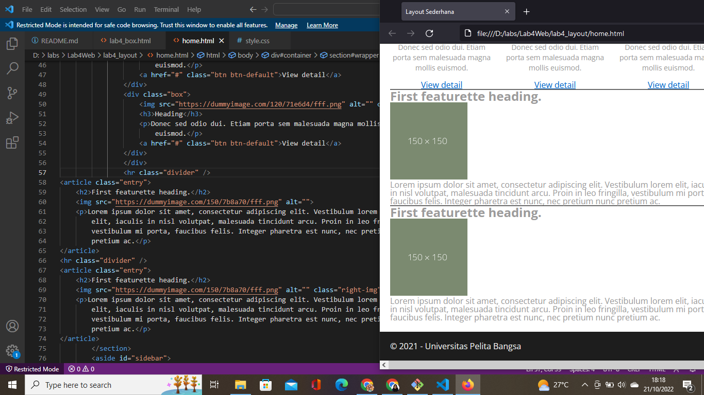

lalu, menggunakan css seperti berikut:
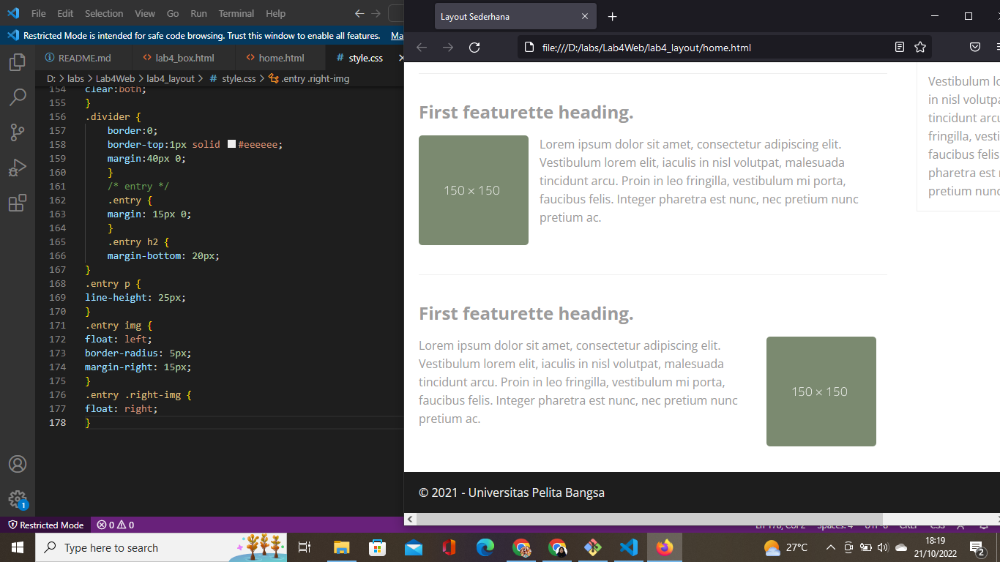

### HASILNYA
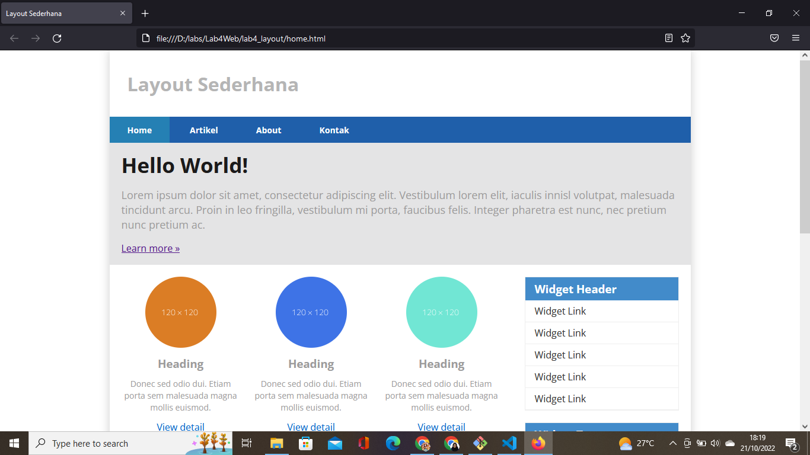
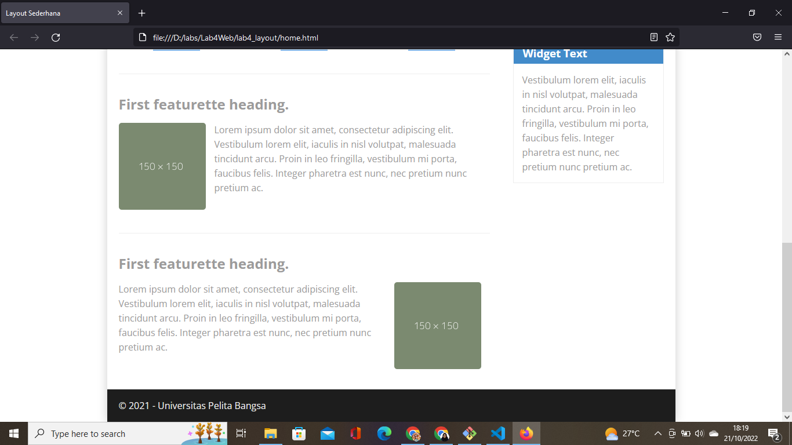